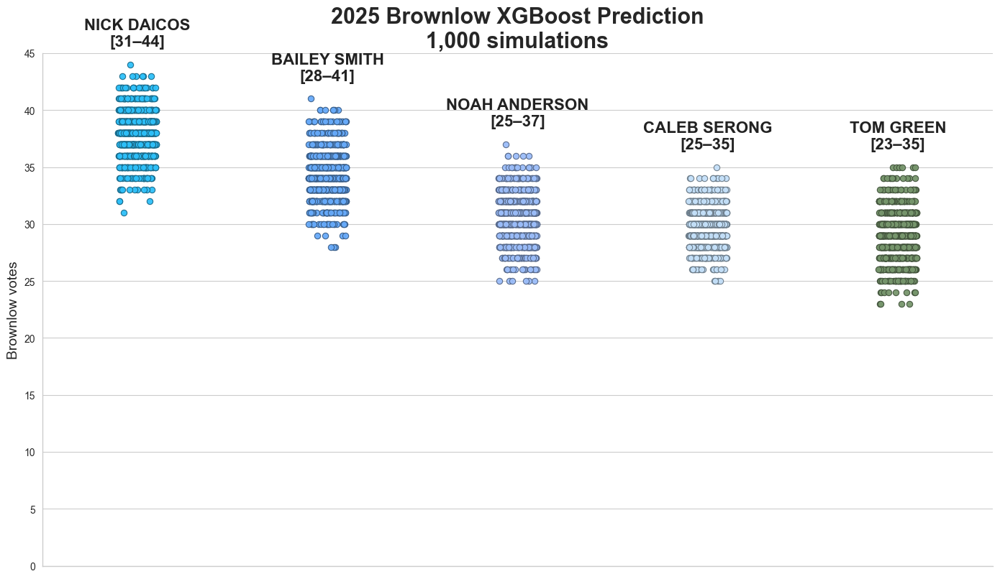

# Brownlow Medal Predictor

Predicts AFL Brownlow Medal votes for every game of a season, then simulates the count to estimate the winner, top pollers, and vote distributions.

**Live 2026 forecast:** https://jay-stein.github.io/brownlow-medal-predictor/

> **Redesign in progress** (branch `feat/2026-prediction`): the project is moving from the notebook regression pipeline to a probabilistic **Plackett–Luce allocation model** with explicitly calibrated uncertainty, evaluated on chronological, match-grouped backtests. See [Probabilistic pipeline](#probabilistic-pipeline-in-progress).



## How It Works (legacy notebook pipeline)

1. **Data extraction (R)** — [`R/fitzroy_data_extract.Rmd`](R/fitzroy_data_extract.Rmd) downloads per-game player stats, match results, and historical Brownlow votes (2018–2024) via the [`fitzRoy`](https://cran.r-project.org/package=fitzRoy) package and writes them to `data/`.
2. **Feature pipeline (Python)** — [`notebooks/xgboost_predict_brownlow_v2.ipynb`](notebooks/xgboost_predict_brownlow_v2.ipynb) merges player and team stats, excludes finals, joins Brownlow votes as the training label, and engineers features: player points, venue/outcome, margin, minutes in front, and per-team `*_prop` share features.
3. **Model training** — `xgboost.cv` (10-fold, early stopping) selects the boosting round for a `reg:pseudohubererror` / MAE objective. 100 models are then trained on random feature subsets with different seeds; predictions are aggregated into `pred_mean`, `pred_median`, `pred_std`, `pred_p05`, `pred_p95`.
4. **Vote scoring** — Players are ranked within each match by predicted float votes; the top three per match receive 3/2/1 Brownlow points.
5. **Monte Carlo** — [`notebooks/montecarlo_predict_brownlow_v1.ipynb`](notebooks/montecarlo_predict_brownlow_v1.ipynb) samples 1,000 vote values per player-game from `Normal(pred_mean, pred_std)`, re-ranks every simulated match, and aggregates season totals, win likelihood, and vote ranges.
6. **Backtesting** — [`notebooks/xgboost_brownlow_backcast.ipynb`](notebooks/xgboost_brownlow_backcast.ipynb) re-runs the pipeline with a chosen season held out (`test_year`, default 2022) and writes predicted leaderboards to `backcast/`.

## Probabilistic pipeline (in progress)

The `src/brownlow/` package implements the redesign: 124 features (the original 120 plus centre-bounce attendances, player height, and height relative to same-position peers), two score generators, and calibrated season simulation.

1. **Audited labels** — `ingest.py` builds a Champion Data ↔ AFL Tables player crosswalk (compact name keys, surname/team/date fallback, generational-suffix handling) and attaches **three-state labels**:
   - `voted` — matched to a resolved match record and polled votes
   - `zero` — matched to a resolved match record and polled no votes (a genuine zero)
   - `unresolved` — identity join failed or a match's recipients did not all map; **quarantined from training**, never silently treated as zero
2. **Chronological, match-grouped evaluation** — `folds.py` trains on earlier seasons and evaluates on the next (development folds 2015–2024, final untouched `2012–24 → 2025`). Every match stays in one partition and preprocessing is fit on training seasons only.
3. **Explicit round selection** — `model.py` runs match-grouped CV and takes the mean best iteration across folds, rather than relying on a truncated CV history.
4. **Plackett–Luce allocation** — `pl.py` models each match as a distribution over ordered 3–2–1 triples, with a single temperature `tau` fitted on out-of-sample scores and exact `P(0/1/2/3)` marginals in closed form.

Data audit (2012–2025): **1,824 players crosswalked** across Champion Data and AFL Tables, **zero unmatched or ambiguous**, every fixture resolved, and only genuinely missing AFL Tables rows quarantined (5 in 2024, 83 in 2025). The extraction covers 14 label seasons (2012–2025) plus 2026 feature data.

Features added in this milestone: **centre bounce attendances** (2021+, left missing for earlier seasons so XGBoost handles the era), **player height**, and **height relative to same-position peers in the match**.

Chronological backtest (`--model ranking`; scores trained only on earlier seasons, `tau` fitted leak-free on earlier out-of-sample seasons), 2015–2025:

| Season | allocation NLL | skill vs uniform | top-1 hit | top-3 slot overlap |
|--------|----------------|------------------|-----------|--------------------|
| 2015 | 5.08 | 0.55 | 0.59 | 0.66 |
| 2016 | 4.64 | 0.59 | 0.63 | 0.69 |
| 2017 | 4.58 | 0.59 | 0.60 | 0.69 |
| 2018 | 4.83 | 0.57 | 0.55 | 0.69 |
| 2019 | 4.53 | 0.60 | 0.61 | 0.70 |
| 2020 | 5.62 | 0.50 | 0.57 | 0.64 |
| 2021 | 4.79 | 0.58 | 0.67 | 0.69 |
| 2022 | 4.36 | 0.62 | 0.62 | 0.70 |
| 2023 | 6.16 | 0.46 | 0.51 | 0.60 |
| 2024 | 5.80 | 0.49 | 0.52 | 0.61 |
| 2025 | 5.50 | 0.52 | 0.51 | 0.64 |

Season spread calibration (persistent player-season effect at the calibrated scale 0.4; contender set = observed top-15):

| Metric | Result |
|--------|--------|
| Contender 90% interval coverage | mean **0.885** (nominal 0.90; range 0.73–1.00) |
| Contender 50% interval coverage | mean **0.486** (nominal 0.50) |
| Simulated-vs-observed Spearman correlation | 0.73–0.78 in every season |
| Favourite (highest simulated mean) won | 5 of 11 seasons |
| Eventual winner's mean P(win) | **0.36** (range 0.02–0.94) |

The model is honest rather than decisive: the eventual winner carried a 36% average pre-count probability and was ranked first in 5 of 11 seasons. The 2024 and 2025 winners (45 and 39 votes) were over-performers the model ranked 2nd and 9th, yet contender intervals still covered 73% and 87% of that season's leading players.

## Repository Structure

```text
brownlow/
├── R/extract_fitzroy.R               # fitzRoy extraction: players, results, votes
├── R/extract_squads.R                # AFL API squads: height and position
├── R/fitzroy_data_extract.Rmd        # original extraction document
├── archive/                          # original 2022 notebook
├── backcast/                         # legacy backtest leaderboards
├── data/                             # raw inputs + processed outputs (gitignored)
├── docs/agent-sessions/              # agent session summaries
├── models/                           # legacy trained models and ensemble metadata
├── notebooks/                        # legacy pipeline notebooks
├── result/                           # legacy Monte Carlo outputs and plots
├── src/brownlow/                     # uv-managed pipeline package
│   ├── ingest.py                     # crosswalk + audited three-state labels
│   ├── features.py                   # 124-feature engineering (incl. CBA and height)
│   ├── folds.py                      # chronological, match-grouped folds
│   ├── model.py                      # regression + ranking (LambdaMART) score generators
│   ├── scores.py                     # cached per-season out-of-sample scores
│   ├── evaluate.py                   # leak-free tau, NLL/Brier/CRPS/coverage metrics
│   ├── simulate.py                   # persistent-effect season simulator
│   ├── pl.py                         # Plackett-Luce NLL, tau fit, exact marginals
│   └── cli.py                        # audit / baseline / evaluate / calibrate-effects
├── tests/                            # unit tests for the new package
├── web/                              # interactive React forecast visualisation
├── pyproject.toml                    # uv-managed project and dependencies
└── README.md
```

## Quick Start

```bash
git clone https://github.com/jay-stein/brownlow-medal-predictor.git
cd brownlow-medal-predictor
uv sync
```

Rebuild the audited dataset (crosswalk + three-state labels → `data/processed/`):

```bash
uv run python -m brownlow.cli audit
```

Run the chronological backtest (per-season scores are cached and reused):

```bash
uv run python -m brownlow.cli baseline --model ranking --seasons 2013-2025  # out-of-sample scores
uv run python -m brownlow.cli evaluate --model ranking --seasons 2015-2025  # leak-free tau + metrics
uv run python -m brownlow.cli calibrate-effects --model ranking             # effect scale grid
uv run python -m brownlow.cli forecast --model ranking --season 2026        # season simulation
```

The 2026 forecast is written up in [`docs/forecast-2026.md`](docs/forecast-2026.md).

### Interactive visualisation

The `web/` folder contains a React app for exploring the forecast: choose any contender to see their cumulative vote worm with 50% and 90% uncertainty bands, overlay the sampled simulations, and switch to per-round points.

```bash
cd web
npm install
npm run dev        # local dev server
npm run build      # static build in web/dist
```

The app reads `web/public/forecast_2026.json`, which is regenerated with:

```bash
uv run python -m brownlow.cli forecast --model ranking --season 2026 --n-sims 10000 \
  --web-json web/public/forecast_2026.json
```

A hosted copy is deployed to GitHub Pages from `main` by [`.github/workflows/deploy-pages.yml`](.github/workflows/deploy-pages.yml): https://jay-stein.github.io/brownlow-medal-predictor/

Run the tests:

```bash
uv run pytest
```

Follow the [data regeneration steps](data/README.md) to rebuild the large `fitzRoy` extracts before running the legacy notebooks or the new pipeline end to end.

## Data

The large raw datasets are **not committed** — they are regenerated with `fitzRoy` (see [`data/README.md`](data/README.md)). Small prediction-source snapshots and the scraping notebooks are committed so the pipeline can be re-run without re-scraping.

| Committed in `data/` | Source |
|----------------------|--------|
| `afl_website_2025.csv` | AFL API Brownlow award endpoint (scraper notebook) |
| `betfair_2025.csv` | Betfair Data Supplier API (scraper notebook) |
| `2025_espn_predictions.csv` | ESPN Brownlow predictor |
| `espn_historical_predictions.xlsx` | ESPN 2021–2024 predictions (for evaluation) |
| `wheelo-brownlow-predictions.csv` | WheeloRatings |
| `bonus_player_team_map.csv` | Manual player→team fixes for name matching |

| Regenerated locally (gitignored) | Source |
|----------------------------------|--------|
| `player_stats_2012_2026_fitzroy.csv` | Champion Data via `fitzRoy::fetch_player_stats()` (AFL API, 2012+) |
| `team_stats_2012_2026_fitzroy.csv` | `fitzRoy::fetch_results_afl()` |
| `brownlow_stats_2012_2025_fitzroy.csv` | AFL Tables via `fitzRoy::fetch_player_stats_afltables()` (includes `Brownlow.Votes`) |
| `player_details_2012_2026_afl.csv` | AFL API squads (`fetch_squad_afl`): height and position per player-season |

Processed artifacts are written to `data/processed/` by `brownlow.cli audit`: the player crosswalk, the per-season label audit, unmatched/ambiguous player lists, and `labelled_player_games.parquet`.

## Notebooks

Run in this order for a full season prediction with the legacy pipeline:

| # | Notebook | Purpose |
|---|----------|---------|
| 1 | `scrape_aflcom.ipynb` | Scrapes AFL.com.au Brownlow predictor votes → `data/afl_website_2025.csv` |
| 2 | `scrape_betfair.ipynb` | Scrapes Betfair Brownlow vote data → `data/betfair_2025.csv` |
| 3 | `xgboost_predict_brownlow_v2.ipynb` | **Main pipeline**: feature engineering, CV, 100-model ensemble, per-game predictions |
| 4 | `montecarlo_predict_brownlow_v1.ipynb` | 1,000-simulation Monte Carlo, win likelihood, plots |
| 5 | `xgboost_brownlow_backcast.ipynb` | Backtests a held-out season and records predicted leaderboards |

Supporting notebooks:

- `xgboost_predict_brownlow.ipynb` / `xgboost_predict_brownlow_v1.ipynb` — earlier single-model iterations.
- `monte-carlo-espn-afl-betfair.ipynb` — aligns external predictions (ESPN, AFL.com.au, Betfair) to teams/rounds for blending experiments.
- `espn_vote_vs_outcome.ipynb` — evaluates ESPN historical predictions against actual Brownlow votes.

## Models and Outputs

- `models/ensemble_model_info.json` — metadata for all 100 legacy ensemble members (seed + feature subset each).
- `models/xgb_afl_model_0..9*.json` — saved sample of legacy ensemble members.
- `models/xgboost_brownlow_simple.json`, `models/xgb_final_from_cv.json` — single-model baselines.
- `models/ensemble_predictions.csv` — aggregated predictions per 2025 player-game (input to the legacy Monte Carlo, regenerated by notebook 3).
- `result/bronwlon_mc_output_v1.csv` — per-game float predictions from the legacy pipeline.
- `result/brownlow_seaborn.png` — simulated top-5 vote distributions.
- `backcast/run_for_{2022,2023,2024}.csv` — legacy backtest predicted leaderboards.

The 2025 simulation projects the leaders as **Nick Daicos, Bailey Smith, Noah Anderson, Caleb Serong, and Tom Green** (see plot above).

## Environment

Python dependencies are declared in [`pyproject.toml`](pyproject.toml) and locked by `uv` (`uv sync` creates `.venv/` and `uv.lock`). R (≥ 4.1) packages for data extraction: `fitzRoy` (≥ 1.8.0), `dplyr`, `knitr`/`rmarkdown`.

## Roadmap

Redesign phase status:

- [x] **Phase 1 — data repair**: audited crosswalk, three-state labels, chronological match-grouped folds, train-only preprocessing, explicit CV round selection.
- [x] **Phase 2a — allocation core**: Plackett–Luce NLL, temperature fitting, exact `P(0/1/2/3)` marginals, unit tested.
- [x] **Phase 2b — allocation model**: per-season out-of-sample scores, leak-free `tau` on earlier folds, allocation log-loss and Brier backtests.
- [x] **Phase 2c — allocation-aware score generator**: match-grouped LambdaMART (`rank:ndcg`) replacing pseudo-Huber; improves every held-out probability metric and contender season CRPS.
- [x] **Phase 3a — persistent uncertainty**: player-season effect (one calibrated scale, contender-CRPS grid) and a shared simulator used for historical and future seasons.
- [x] **Phase 1b — extended history and features**: 14 label seasons (2012–2025) via `R/extract_fitzroy.R` and height/position squads via `R/extract_squads.R`; centre-bounce attendances and height features; 11-season spread calibration (contender 90% coverage 0.885).
- [ ] **Phase 3b — model variation**: match-block bootstrap ensemble of score generators.
- [x] **Phase 4 — award definitions**: outright first, joint first, first-or-joint and top-5 probabilities in the simulator; player eligibility still to apply at the award stage.
- [x] **Phase 5 — full backtest persistence**: allocation log-loss, Brier, CRPS and interval coverage persisted per season.
- [x] **Phase 6 — 2026 forecast**: post-round-24 conditional forecast with vote quantiles, first-or-joint probabilities and specification sensitivity in [`docs/forecast-2026.md`](docs/forecast-2026.md).

Other follow-ups:

- [ ] Remove legacy hardcoded data paths from the notebooks so the pipeline runs from any clone location.
- [ ] Persist all 100 legacy ensemble members (`save_models = True`) for full reproducibility.

## Caveats

- **Legacy hardcoded paths**: several notebooks read from `C:\Users\mrjay\python\jupyter_notebooks\Projects\brownlow\data\...`. Update these to this repository's `data/` folder (or relative `../data/...`) before running.
- **Gitignored artifacts**: the large `data/*fitzroy.csv` extracts, `data/processed/`, `models/ensemble_predictions.csv`, and `result/*.csv` are not committed and must be regenerated.
- **Quarantined labels**: five 2024 player-games are missing from the AFL Tables export and are marked `unresolved` rather than zero. The remaining unresolved rows are the unlabelled 2025 season, which is expected.
- **Notebook sizes**: `montecarlo_predict_brownlow_v1.ipynb` (~8.6 MB) and other notebooks embed large outputs.

## Credits

- AFL data via [`fitzRoy`](https://github.com/jimmyday12/fitzRoy) (AFL Tables, Footy Wire, The Squiggle).
- Brownlow predictor votes via AFL.com.au API and Betfair Data Supplier API.
- ESPN and WheeloRatings predictions for external comparison.
